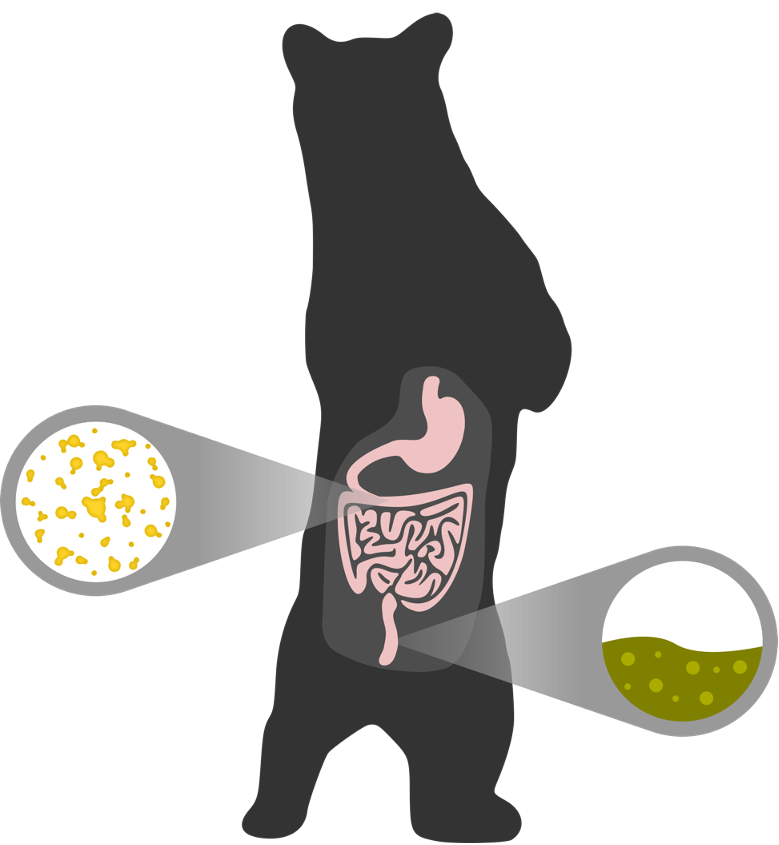

# Wild black bears harbor simple gut microbial communities with little difference between the jejunum and colon (2020)
#### Published Manuscript in Scientific Reports; [DOI: 10.1038](https://doi.org/10.1038/s41598-020-77282-w)
Authors: Sierra J. Gillman, Erin A. McKenney, Diana J.R. Lafferty

Directory structure | Description
--- | ---
blackbear-gme-SR/
  |- README.md
  |- data/ | **Description**
  |- BearMeta-R.tsv | data used in R analysis
  |- BearMeta.tsv | data used in QIIME2-- just slightly different format from above
  |- BlackBeardemuxsequences.qza | demultiplexed EMP-paired end sequences demultiplexed on QIIME2
  |- physeq.rds | phyloseq-R object that can be used if wanting to skip rarifying step
  |- script/ | **Description**
  |- QIIME2 Pipeline.md | bioinformatic pipeline to prepare sequences for analysis in R
  |- Statistical Analysis.R | code required to repeat statistics from manuscript
  |- images/
  |-blackbear.png

  

